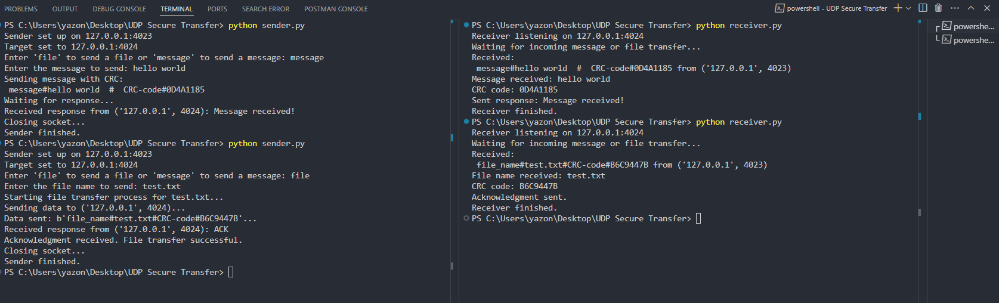

# File Transfer Application using UDP with CRC and MD5 Validation

This project is a Python-based file transfer application using UDP sockets for reliable file transmission. The system includes CRC (Cyclic Redundancy Check) for each packet to ensure data integrity and MD5 checksum validation to verify the entire file once transferred. It includes both a **sender** and a **receiver** component.

## Features

- **UDP-based communication** for file transfer.
- **CRC-32** validation on each packet for integrity checking.
- **MD5 checksum** verification after the file transfer completes.
- Handles file metadata transmission (file name and file size).
- Timeout mechanism to ensure reliable transmission.

## How It Works

1. **Sender** divides the file into chunks, calculates a CRC for each, and sends them along with the file metadata (name, size).
2. **Receiver** validates each chunk using CRC and appends valid chunks into a file.
3. Once the file is transferred, the **MD5 checksum** is calculated on both sides to ensure that the entire file has been received correctly.

## Screenshots

## License

MIT License
Copyright (c) [2024] [Yazan Aladib]
